# Alibabacloud ECS plugin

# Introductionf
This plugin extends Jenkins slave node generation (node provision), in the case of high concurrent 
project integration,use this plugin to form jenins master-slave mode for project integration

Before using this plugin, you need to install the 'alibabacloud credentials plugin'.
Please refer to https://github.com/aliyun/alibabacloud-credentials-jenkins-plugin

# Usage

Before using this product, it is assumed that you have registered your alibaba cloud 
account and obtained the relevant AK and sk.

### Create a key pair of ECS with address: https://ecs.console.aliyun.com/
* Select "network and security" \ > "key pair"
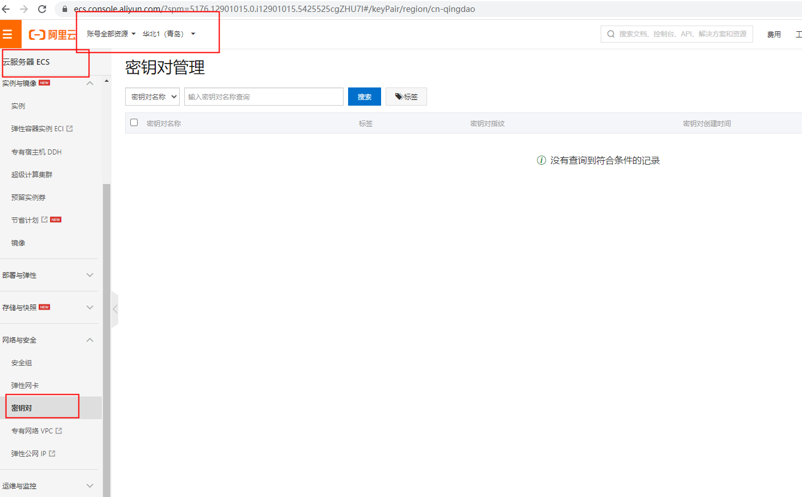
* Click the upper right corner to create a key pair, generate the key according to the prompt, 
and save the generated key pair ".PEM" file
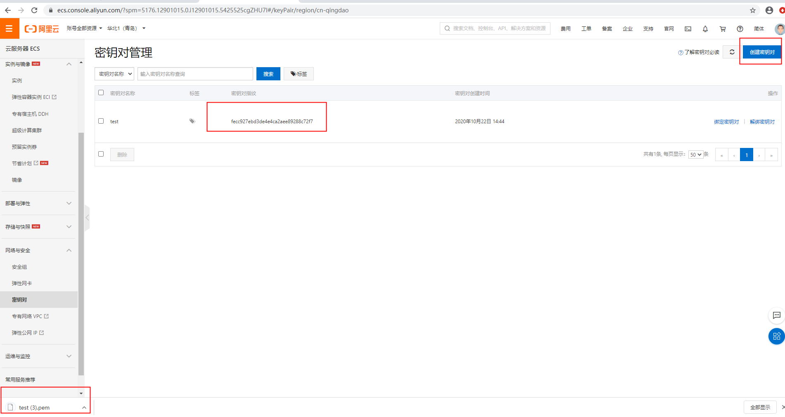

### Download "Alibaba Cloud ECS plugin"
* Enter the installed Jenkins client and go to the "manage Jenkins" / > "manage plugins" / > "available" page
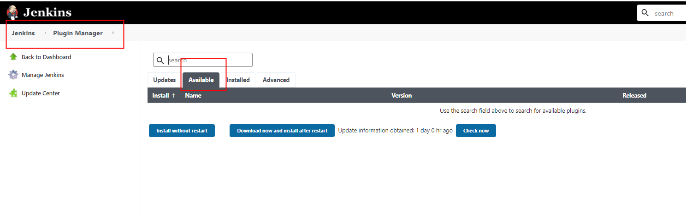
* Enter "Alibaba Cloud ECS" plugin in the search box to download and install

### Configure clouds 
* after installing the plugin, go to "manage Jenkins" / > "manage node and clouds" / > 
"configure clouds" / > on the launched Jenkins
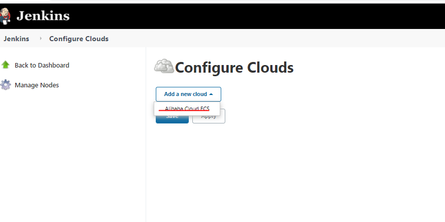

* Click "Alibaba Cloud ECS" 
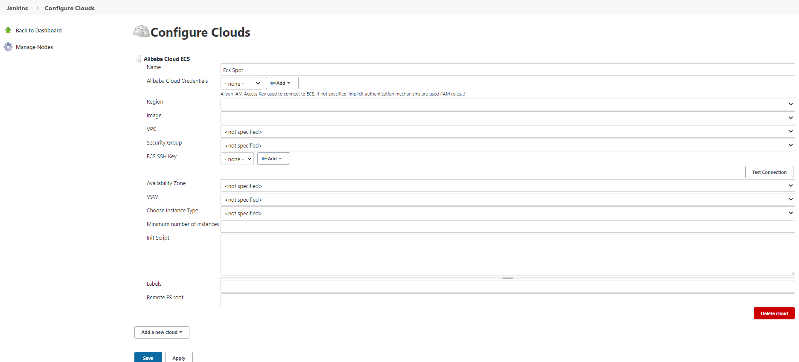
* Follow the prompts for relevant configuration. When you click the Add button of Alibaba cloud credentials to obtain 
Jenkins authentication, add "alibaba cloud credential" and fill in AK and sk of alicloud account.
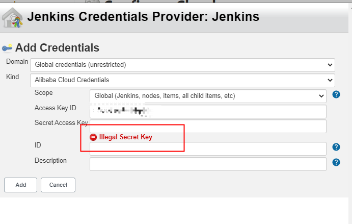

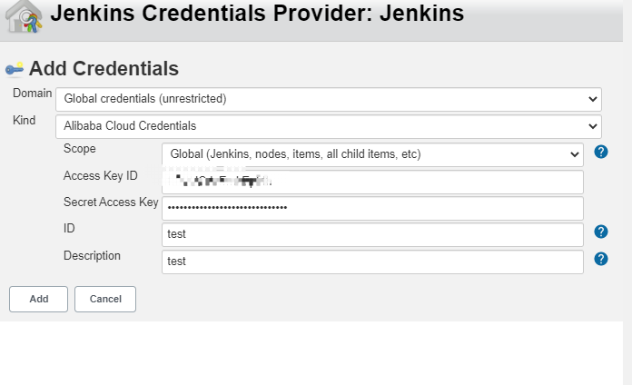
* In the drop-down box, select the name of the credential you just filled in.
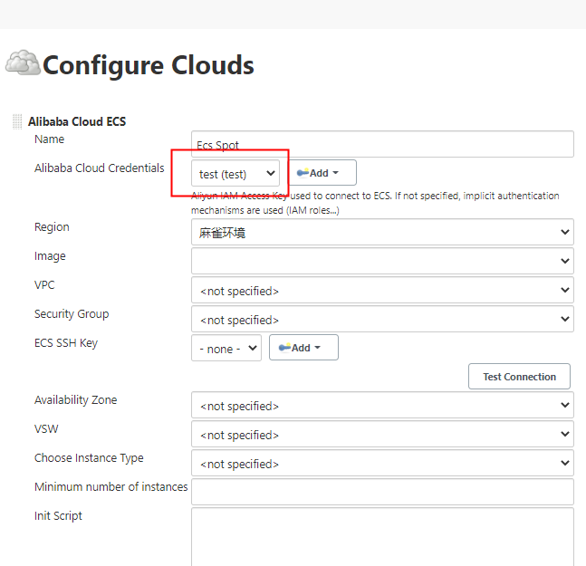
* Then select region, image, VPC, security group

* When configuring the ECS SSH key, click the Add button to get Jenkins, authenticate, and add the contents of the ECS.
PEM file obtained from the ECS console of alibabacloud and fill in
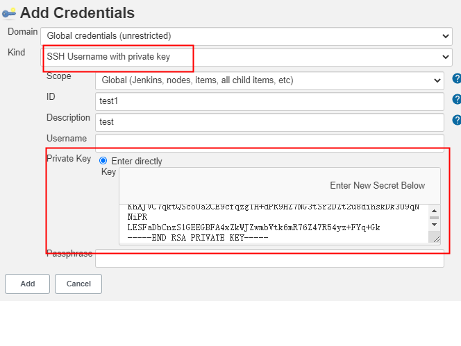
* You can click test to see if it works.
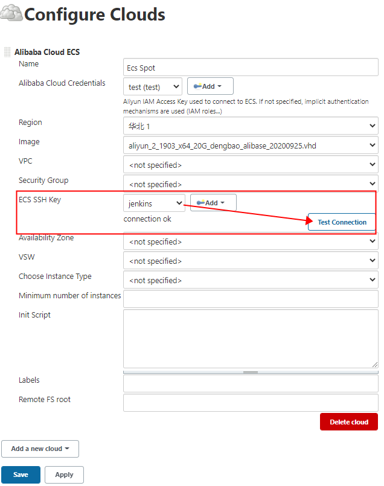

* Select availability zone, VSW, choose instance type.
* Minimum number of instances is the number of slave nodes used to generate the slave. 
The server will generate the slave according to the number filled in. The number should be at least 1

* Init script is the shell script to be run on the newly launched slave node
instance, before Jenkins starts launching a slave node. This is also a good place to install additional 
packages that you need for your builds and tests.

* After saving successfully, enter new nodes to add nodes. The initialization status is as follows:
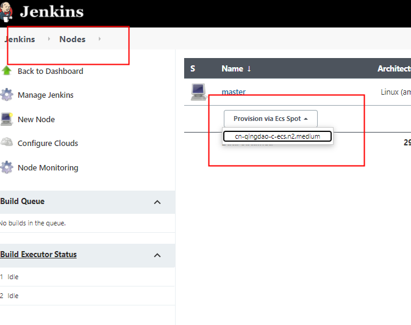
* After clicking the instance of sprovision via pot, the slave node will be initialized as follows:
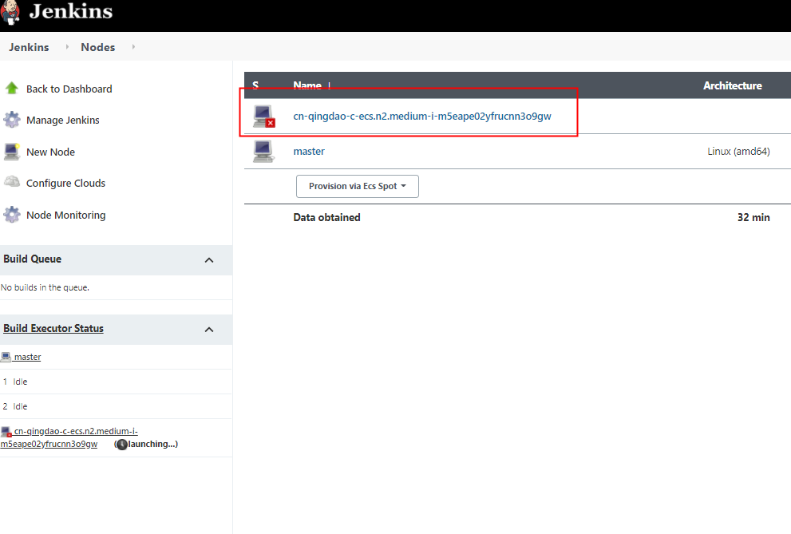
* After a while, the state will be restored after the connection.
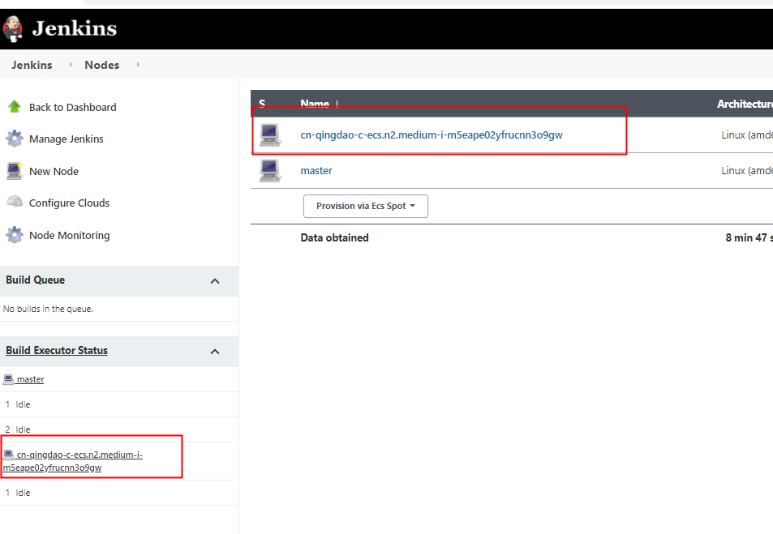
* Click the node drop-down box to perform relevant operations on the slave node.
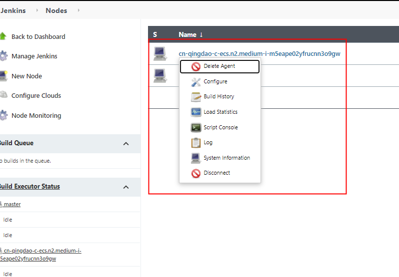
* Click Configure to view the slave node information

