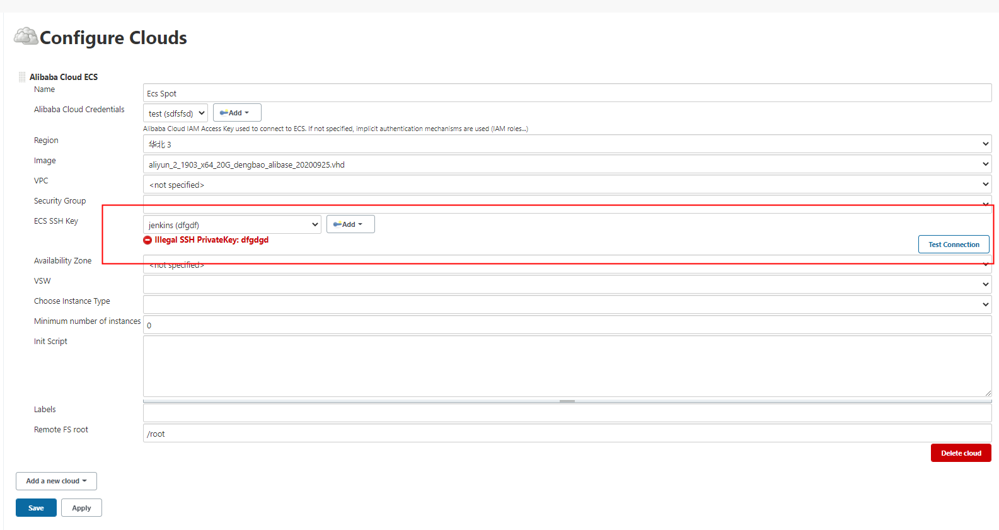
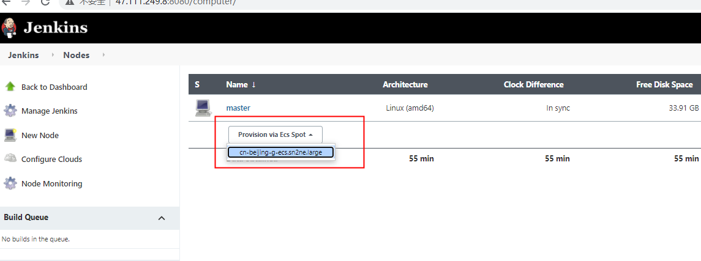
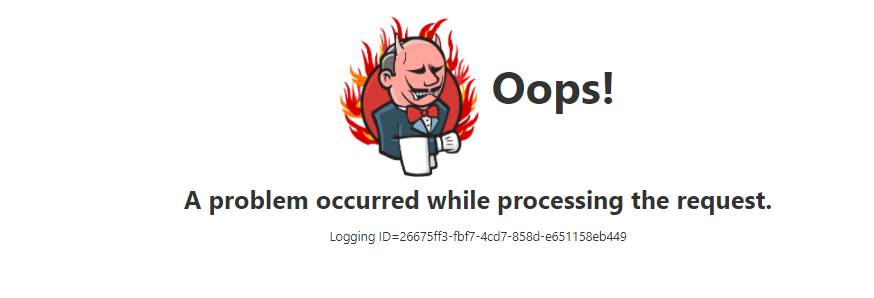

# Alibabacloud ECS plugin

See the [中文文档](README_ZH_CN.md) for Chinese readme.
# Table of contents
   * [Introduction](#introduction)
   * [Usage](#usage)
      * [Prerequisites](#Prerequisites)
      * [Create a key pair](#SSHKey)
      * [Download plugin](#downloadPlugin)
      * [Configure clouds](#configureClouds)
         * [Navigate to Configure Clouds Menu](#cloudsMenu)
         * [Add New Cloud](#addNewCloud)
         * [Configure "Cloud Name"](#cloudsName)
         * [Configure "Credentials"](#configurAkSK)
            * [Add new credentials **-Required**](#addNewCredentials)
            * [Select "Alibaba Cloud Credentials" **-Required**](#alibabaCloudCredentials)
            * [Input "Access Key ID" & "Secret Access Key" **-Required**](#inputAkAndSk)
            * [Configure "Credentials" **-Required**](#configureCredentials)
         * [Configure "Region" **-Required**](#configureRegion)
         * [Configure "Image" **-Required**](#configureImage)
         * [Configure "VPC" **-Optional**](#configureVpc)
         * [Configure "Security Group" **-Optional**](#securityGroup)
         * [Configure "ECS SSH Key" **-Required**](#ecsSSHKey)
         * ["Test Connection" **-Required**](#testConnection)
         * [Configure "Available Zone" **-Optional**](#availableZone)
         * [Configure "VSW" **-Optional**](#configureVSW)
         * [Configure "Instance Type" **-Optional**](#instanceType)
         * [Configure "Minimum number of instances" **-Optional**](#minimumNumberOfInstance)
         * [Configure "Init Script" **-Optional**](#configureInitScript)
         * [Configure "Labels" **-Optional**](#configureLabels)
         * [Configure "Remote FS root" **-Optional**](#remoteFSRoot)
      * [Provision Nodes ](#provisionNodes)
   * [Trouble Shooting](#troubleShooting)
   * [Change Log](#changeLog)
   * [Contact us](#contactUs)

# Introduction
This plugin implements Jenkins slave node provision mechanism. In CI/CD scenario, if your Jenkins master node is under high workload, use this plugin to provision slave [ECS](https://help.aliyun.com/document_detail/25367.htm) node, offloading master's workloads.

The graph below illustrate how the Jenkins Master & Slave mechanism works.

# Usage

## Prerequisites
Before starting, please make sure you have met the following requirements:    
1. [Alibaba Cloud Account](https://account.aliyun.com/login/qr_login.htm). For international user, please refer to [Alibaba Cloud Global Account](https://account.alibabacloud.com/login/login.htm)
2. [Alibaba Cloud AccessKey/SecretKey](https://ram.console.aliyun.com/manage/ak) for API access.

3. Jenkins Master: A running Jenkins master is necessary, this plugins only provision slave node, and DOES NOT provision master node. 

## STEP 1: Create a key pair for ECS 
A key pair is necessary for the provisioned node in order to communicate with master node using SSH tunnel.
 
1.1 Login to [ECS Console](https://ecs.console.aliyun.com/)

1.2. Navigate to "Network and Security" > "Key Pair" menu

1.3. Generate a Key Pair 
Click "Create SSH Key Pair" button, generate the key according to the prompt, and save the generated key pair in ".PEM" format

## STEP 2: Search & Download Alibaba Cloud ECS plugin 
2.1 Login to your own Jenkins console. Navigate to the "Manage Jenkins" > "Manage Plugins" > "Available" menu

2.2 Type and search "Alibaba Cloud ECS"

2.3 Install the plugin

[Alibaba Cloud Credentials Plugin](https://plugins.jenkins.io/alibabacloud-credentials/) is necessary and will also be installed. 

## STEP 3: Configure Clouds 
### 3.1 Navigate to Configure Clouds Menu 
Once you have finished the installation of ECS plugin, navigate to "Manage Jenkins" > "Manage Node and Clouds" > "Configure Clouds" menu

### 3.2 Add New Cloud 
Select "Alibaba Cloud ECS"

 

### 3.3 Configure "Cloud Name" 
A name is mandatory to identify the clouds. 

### 3.4 Configure "Credentials" 
An effective is necessary. Plugin uses the credential(aka ak/sk) to invoke Alibaba Cloud ECS OpenAPI in order to create ECS as slave node. 

#### 3.4.1 Add new credentials **-Required** 

#### 3.4.2 Select "Alibaba Cloud Credentials" **-Required** 

#### 3.4.3 Input "Access Key ID" & "Secret Access Key" **-Required** 
* Type in the ak/sk you've previously created in [Prerequisites](#Prerequisites) part
* Please make sure you don't have any warnings listed below: 

#### 3.4.4 Configure "Credentials" **-Required** 
Select the credentials you've just created 

### 3.5 Configure "Region" **-Required** 
Select the right region where the slave ECS node will be provisioned.

### 3.6 Configure "Image" **-Required** 
Select the right image type.

### 3.7 Configure "VPC" **-Optional** 
If there is any VPCs in your selected region, they will be listed in the "VPC" drop down list. And if no VPC found, a default VPC will be created with 172.16.0.0/12 CIDR block

### 3.8 Configure "Security Group" **-Optional** 
If there is any Security Groups in your selected region, they will be listed in the "Security Group" drop down list. And if no security group found, a default security will be created with "22/22" port range access.

### 3.9 Configure "ECS SSH Key" **-Required** 
* Enter the SSH Key obtained in [STEP 1: Create a key pair for ECS](#SSHKey)
* Currently, only "SSH username with private key" is supported.

### 3.10 "Test Connection" **-Required** 
Before going on, you should click "Test Connection" button to run a thoroughly check and make sure all the required items are successfully configured.  

### 3.11 Configure "Available Zone" **-Optional** 
Select the right available zone where the slave ECS node will be provisioned. And if no Available Zone selected, a random zone will be selected.

### 3.12 Configure "VSW" **-Optional** 
Select the right vsw where the slave ECS node will be provisioned. And if no VSW selected, a random vsw that doesn't overlap with the existing vsws will be created.

### 3.13 Configure "Instance Type" **-Optional** 
Select the right instance type that the slave ECS node will be provisioned. And if no instance type selected, a random instance type will be selected.

### 3.14 Configure "Minimum number of instances" **-Optional** 
Minimum number of instances is the number of follower nodes used to generate the follower. 
This plugin will create the follower according to the number filled in. The number should be at least 1

### 3.15 Configure "Init Script" **-Optional** 
Init script is the shell script to be run on the newly launched follower node instance, before Jenkins starts launching a follower node. 
This is also a good place to install additional packages that you need for your builds and tests.

### 3.16 Configure "Labels" **-Optional** 

### 3.17 Configure "Remote FS root" **-Optional** 

## STEP 4: Provision Nodes 
* After saving successfully, enter new nodes to add nodes. The initialization status is as follows:

* After clicking the instance of provision via pot, the follower node will be initialized as follows:

* After a while, the state will be restored after the connection.

* Click the node drop-down box to perform relevant operations on the follower node.

* Click Configure to view the follower node information

# Trouble Shooting 
* When you click the Save button, if the "SSH username with private key" connection test fails, the save 
will succeed, but "provision node" will report an error of "a problem occurred while processing the request". 
Therefore, please ensure that the connection is successful before saving.

* Examples are as follows:

# Change Log 
[changelog](https://github.com/jenkinsci/alibabacloud-ecs-plugin/blob/master/CHANGELOG.md)

#Contact us 
* If you have any questions or requirements, please scan the following QR code with [DingTalk QRCode](https://www.dingtalk.com/en)
* DingTalk Group Number：44723358
* DingTalk Group QR code

  

