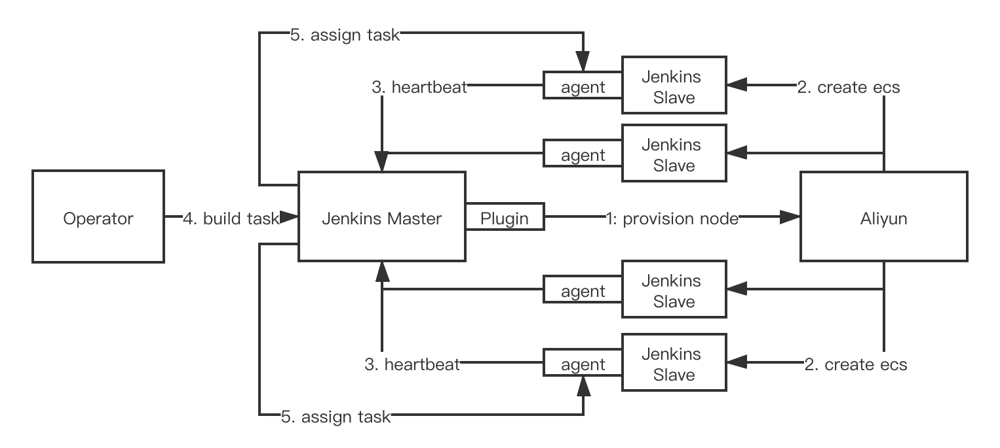
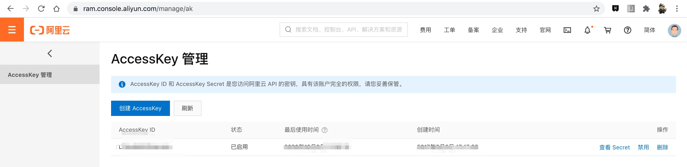
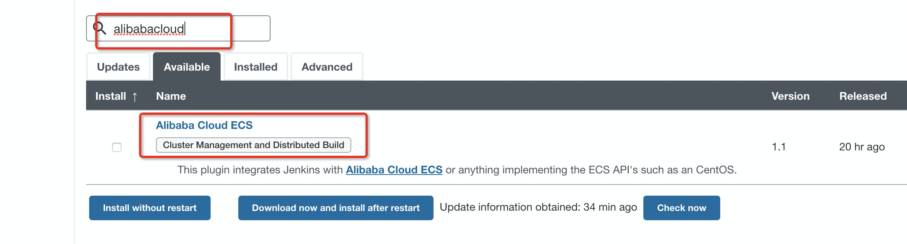
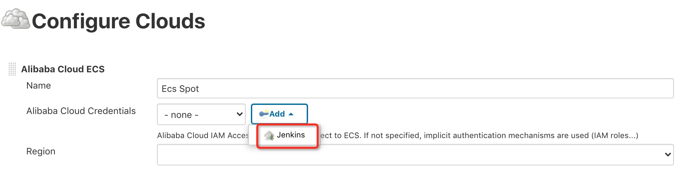
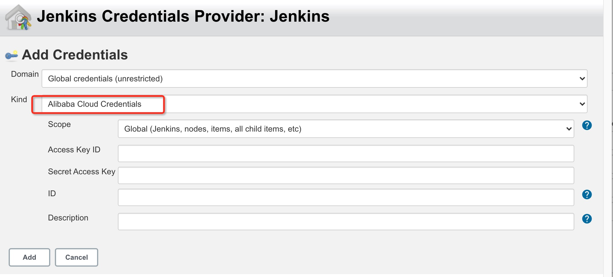
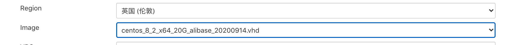
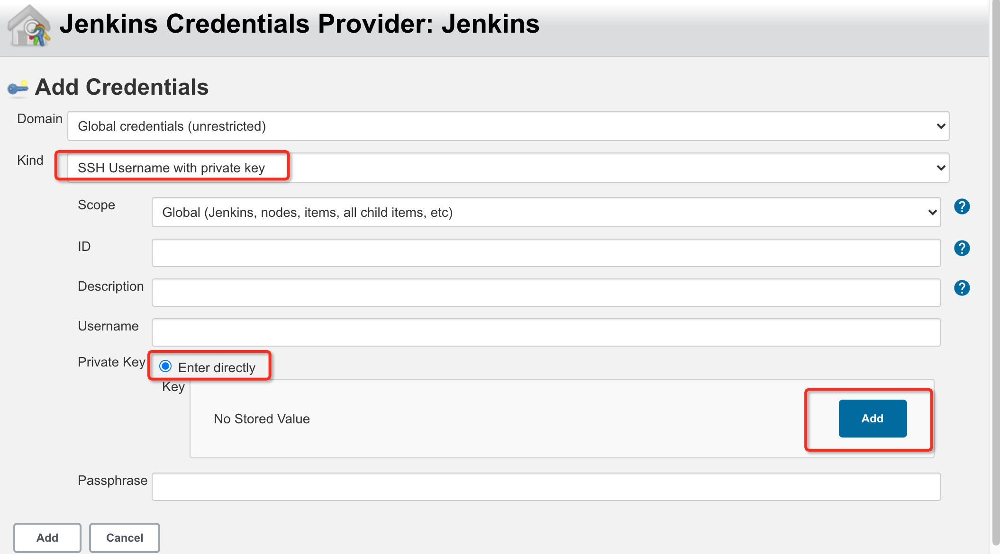
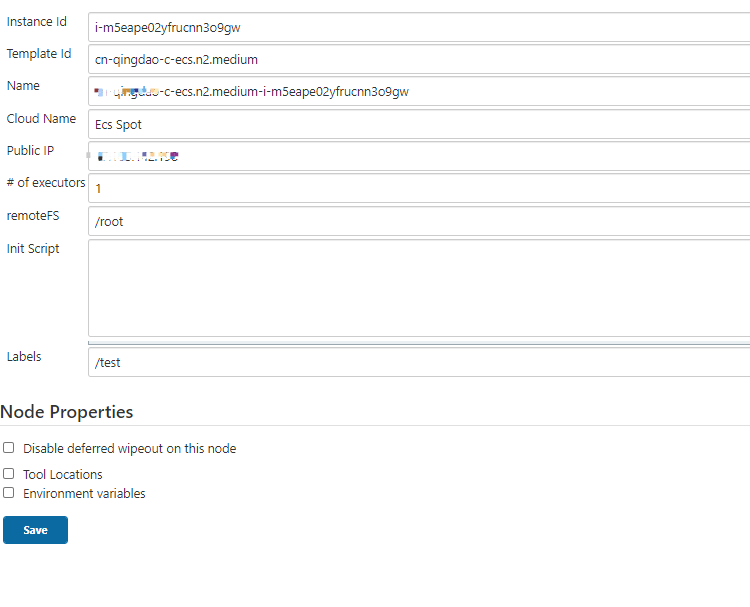

# Alibabacloud ECS plugin

# 目录
   * [介绍](#introduction)
   * [用法](#usage)
      * [前置条件](#Prerequisites)
      * [创建密钥对](#SSHKey)
      * [下载插件](#downloadPlugin)
      * [配置云](#configureClouds)
         * [导航到“Configure Clouds”](#cloudsMenu)
         * [添加新的云](#addNewCloud)
         * [配置“Cloud Name”](#cloudsName)
         * [勾选“Jenkins Master In Private Network?“](#privateNetwork)
         * [配置“Credentials”](#configurAkSK)
            * [添加新凭据 **-必填**](#addNewCredentials)
            * [选择“Alibaba Cloud Credentials” **-必填**](#alibabaCloudCredentials)
            * [输入“Access Key ID" & "Secret Access Key” **-必填**](#inputAkAndSk)
            * [配置“Credentials” **-必填**](#configureCredentials)
         * [配置“Region” **-必填**](#configureRegion)
         * [配置“Image” **-必填**](#configureImage)
         * [配置“VPC” **-可选**](#configureVpc)
         * [配置“Security Group” **-可选**](#securityGroup)
         * [配置“ECS SSH Key” **-必填**](#ecsSSHKey)
         * [“Test Connection” **-必填**](#testConnection)
         * [配置“Available Zone” **-可选**](#availableZone)
         * [配置“ VSW” **-可选**](#configureVSW)
         * [配置“Instance Type” **-可选**](#instanceType)
         * [配置“Minimum number of instances” **-可选**](#minimumNumberOfInstance)
         * [配置“Init Script” **-可选**](#configureInitScript)
         * [配置“Labels” **-可选**](#configureLabels)
         * [配置“Remote FS root” **-可选**](#remoteFSRoot)
         * [配置“System Disk Category” **-可选-**](#systemDiskCategory)
         * [配置“System Disk Size” **-可选-**](#systemDiskSize)
         * [勾选“Assign Public Ip“](#publicIp)
      * [添加节点](#provisionNodes)
   * [故障排查](#troubleShooting)
   * [变更日志](#changeLog)
   * [联系我们](#contactUs)

# 介绍 <a id="introduction"/>
该插件实现Jenkins从节点提供机制。在CI / CD方案中，如果您的Jenkins主节点工作量很大，请使用此插件来配置从节点 [ECS](https://help.aliyun.com/document_detail/25367.htm) , 减轻主节点的工作量。

下图说明了jenkins主从机制的工作原理。

# 用法 <a id="usage"/>

## 前置条件 <a id="Prerequisites"/>
开始之前，请确保您满足以下要求：
1. [阿里云账户](https://account.aliyun.com/login/qr_login.htm)。 对于国际用户，请参阅 [阿里云全球账户](https://account.alibabacloud.com/login/login.htm)
2. [阿里云 AccessKey/SecretKey](https://ram.console.aliyun.com/manage/ak) 用于API的访问。

3. Jenkins主服务器：需要运行的Jenkins主服务器，此插件仅预配置从节点，不预配置主节点。

## 步骤1：为ECS创建密钥对 
为了使用SSH隧道与主节点进行通信，预配节点必须有一个密钥对。
 
1.1 登录到 [ECS 控制台](https://ecs.console.aliyun.com/)

1.2. 导航到“网络和安全性” > “密钥对”菜单

1.3. 生成密钥对
单击“创建SSH密钥对”按钮，根据提示生成密钥，并将生成的密钥对保存为“ .PEM”格式

## 步骤2：搜索并下载阿里云ECS插件 
2.1 登录到您自己的Jenkins控制台。导航到“管理Jenkins”>“管理插件”>“可选插件”菜单

2.2 键入并搜索“Alibaba Cloud ECS”

2.3 安装插件

[Alibaba Cloud Credentials Plugin](https://plugins.jenkins.io/alibabacloud-credentials/) 是必需的，也需要被安装。

## 步骤3：配置Clouds 
### 3.1 导航到“Configure cloud”菜单 
ECS插件安装完成后，导航至“管理Jenkins”>“管理节点和云”>“配置云”菜单

### 3.2 添加新云(Add a new Cloud) 
选择 "Alibaba Cloud ECS"

 

### 3.3 配置云“Name” 
必须使用名称来标识云。

### 3.4 勾选“Jenkins Master In Private Network” 
当前Jenkins Master是否部署在VPC内网环境中(即是否有访问公网的权限). 
如果您的Jenkins Master部署在内网环境中(即没有访问公网权限), 请勾选此项, 后续插件调用阿里云SDK会使用VPC私网域名进行请求. 
如果不勾选此项, 默认会使用公网域名进行访问, 会导致访问不通, 
从而后续使用该插件会出现"ConnectTimeoutException"异常 如果在公网环境中(即有访问公网权限), 则无需勾选此项, 后续调用阿里云SDK会使用公网域名进行请求.

### 3.5 配置“Alibaba Cloud Credentials” 
必须是有效的凭据。插件使用凭据（ak / sk）调用阿里云ECS OpenAPI，以将ECS创建为从节点。

#### 3.5.1 添加新凭据**-必填** 

#### 3.5.2 选择“Alibaba Cloud Credentials” **-必填** 

#### 3.5.3 输入 "Access Key ID" & "Secret Access Key" **-必填** 
* 输入您之前在 [前置条件](#Prerequisites) 创建的"Access Key ID" & "Secret Access Key"
* 请确保您没有在下面列出任何警告：

#### 3.5.4 配置“Alibaba Cloud Credentials” **-必填** 
选择您刚刚创建的凭证

### 3.6 配置“Region” **-必填** 
选择将在其中配置从ECS节点的正确区域。

### 3.7 配置“Image” **-必填** 
选择正确的镜像类型。

### 3.8 配置“ VPC” **-可选** 
如果所选区域中有任何VPC，它们将列在“ VPC”下拉列表中。并且如果未找到VPC，将使用172.16.0.0/12 CIDR块创建默认的VPC。

### 3.9 配置“Security Group” **-可选** 
如果所选区域中有任何安全组，它们将列在“安全组”下拉列表中。如果未找到安全组，将使用“ 22/22”端口范围访问权限创建默认安全。

### 4.0 配置“ ECS SSH密钥” **-必填** 
* 输入在[步骤1：为ECS创建密钥对](#SSHKey)中获得的SSH密钥 
* 当前，仅支持“带有私钥的SSH用户名”。

### 4.10 "Test Connection" **-必填** 
在继续之前，您应该单击“测试连接”按钮进行彻底检查，并确保所有必需的项目都已成功配置。  

### 4.11 配置“Availability Zone” **-可选** 
选择将在其中配置从ECS节点的正确可用区域。如果未选择可用区域，则将选择一个随机区域。

### 4.12 配置“ VSW” **-可选** 
选择将在其中配置从ECS节点的右侧vsw。如果没有选择VSW，将创建一个与现有vsws不重叠的随机vsw。

### 4.13 配置“Instance Type” **-可选** 
Select the right instance type that the slave ECS node will be provisioned. And if no instance type selected, a random instance type will be selected.

### 4.14 配置 "Minimum number of instances" **-可选** 
最小实例数是用于生成关注者的关注者节点的数量。
此插件将根据填写的数字创建子节点。该数字至少应为1

### 4.15 配置 "Init Script" **-可选** 
Init脚本是在Jenkins开始启动跟随者节点之前在新启动的跟随者节点实例上运行的Shell脚本。
这也是安装构建和测试所需的其他软件包的好地方。

### 4.16 配置 "Labels" **-可选** 

### 4.17 配置 "Remote FS root" **-可选** 

* [配置“System Disk Size” **-可选-**](#systemDiskSize)
* [勾选 Assign Public Ip](#publicIp)

### 4.18 配置 "System Disk Category" 
 
### 4.19 配置 "System Disk Size" 

### 4.20 勾选 "Assign Public Ip" 
是否设置公网ip

## 步骤4: 添加节点 
* 保存成功后，输入新节点以添加节点。初始化状态如下：

* 通过pot单击提供实例后，将按照以下方式初始化子节点：

* 一段时间后，连接后状态将恢复。

* 单击节点下拉框，以在跟随者节点上执行相关操作。

* 单击配置以查看跟随者节点信息

# 故障排查 
* 当您单击“保存”按钮时，如果“带有私钥的SSH用户名”连接测试失败，则保存将成功，但是“设置节点”将报告错误“处理请求时发生问题”。因此，保存前请确保连接成功。

# 变更日志 
[变更日志](https://github.com/jenkinsci/alibabacloud-ecs-plugin/blob/master/CHANGELOG.md)

# 联系我们 
* 如果您有任何疑问或要求，请用[钉钉](https://www.dingtalk.com/en) 扫描以下二维码

